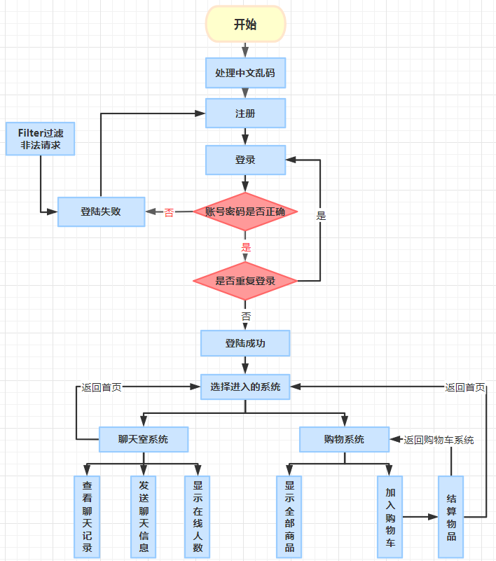
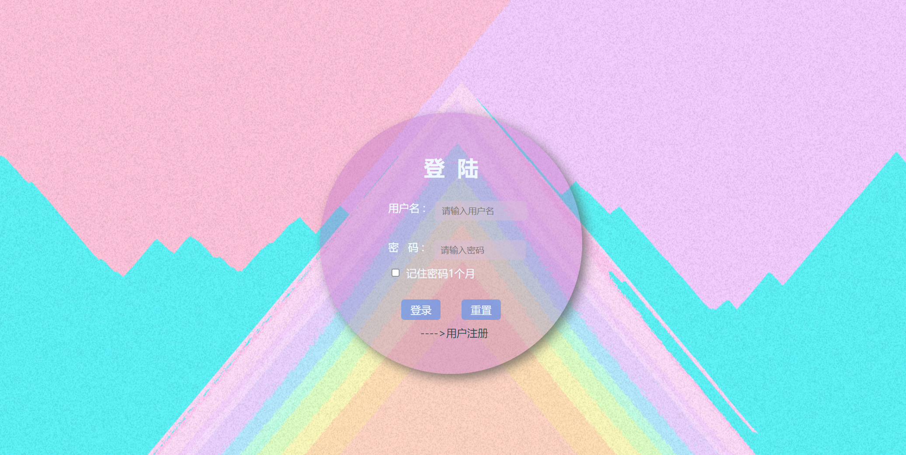
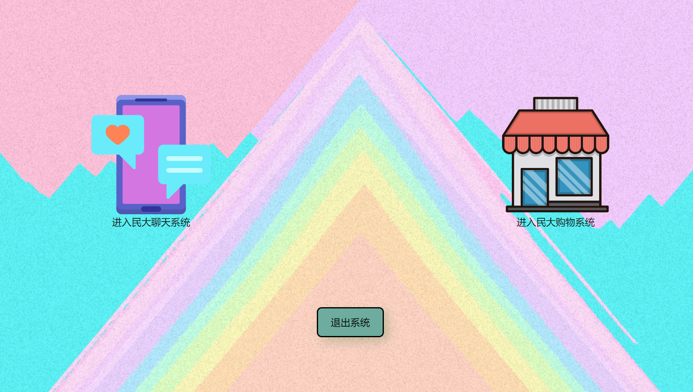
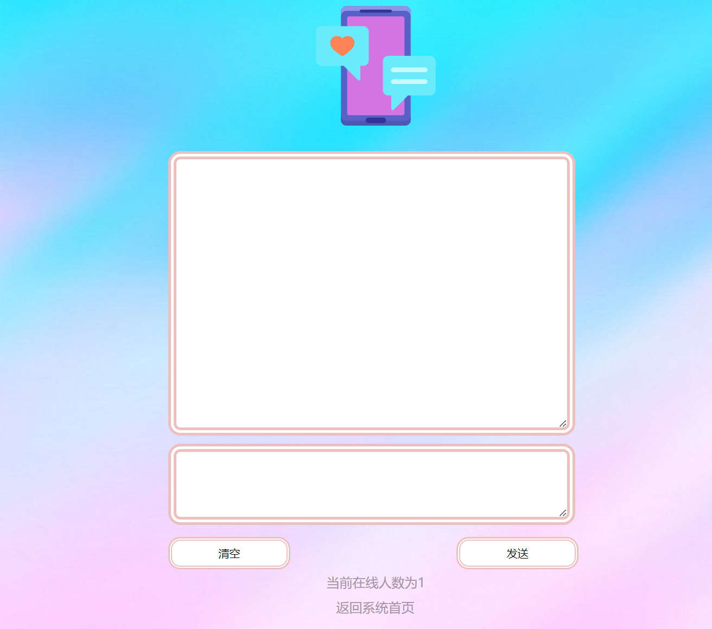
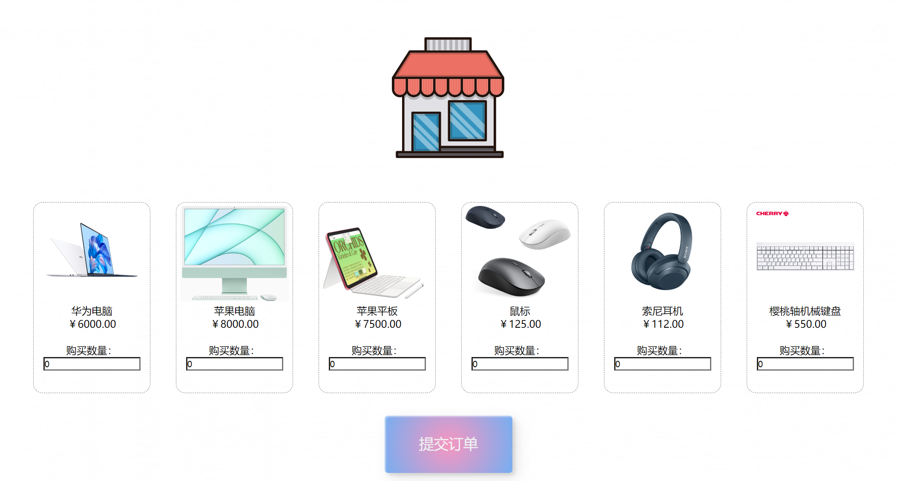
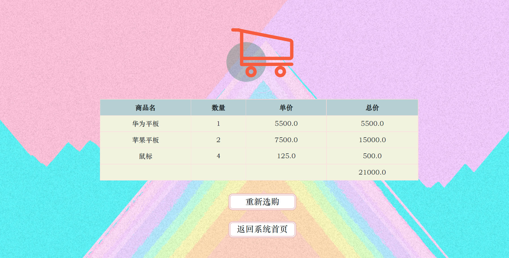

# JavaEE_ChatAndShopping

## 项目环境

### 运行环境

IDEA：2022.2.2

Tomcat：8

### 数据库版本环境

数据库：mysql

可视化工具：Navicat 15

## 项目技术

运用了基本的jsp+servlet+mysql+javabean等技术

## 项目功能流程图

## 项目页面展示

### 登录界面

### 系统首界面

### 聊天界面

### 购物界面

### 购物车界面

